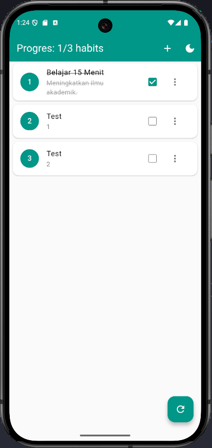

# Tugas 6 - Mini Habit Tracker

**Nama:** Sakahayu Pribadi  
**NPM:** 4522210062  
**Dosen Pengampu:** Adi Wahyu Pribadi S.SI., M.Kom.  
**Program Studi:** Teknik Informatika  
**Universitas Pancasila - 2025**

---

## 1. Jalankan aplikasi (flutter run).

**Screenshot:** \

## 2. Uji Strikethrough: Centang dan batalkan centang habit. Perhatikan teksnya.

**Screenshot:** \

## 3. Uji Tambah Habit:

- Klik tombol + di AppBar.
  **Screenshot:** \
  

- Coba simpan tanpa mengisi nama (validasi harus mencegah).
  **Screenshot:** \
  

- Isi form dan simpan. Verifikasi habit baru muncul di list.
  **Screenshot:** \
  
  

## 4. Uji Edit Habit:

- Klik menu tiga titik pada habit, pilih "Edit".
- Dialog harus muncul dengan data habit tersebut.
  **Screenshot:** \
  

- Ubah nama/deskripsi dan simpan. Verifikasi perubahan di list.
  **Screenshot:** \
  
  

## 5. Uji Hapus Habit:

- Klik menu tiga titik pada habit, pilih "Hapus".
  

- Dialog konfirmasi harus muncul. Coba batalkan.
  
  

- Coba hapus lagi dan konfirmasi. Verifikasi habit hilang dari list.
  

## 6. Uji Progress Bar: Pastikan progress di AppBar terupdate setelah menambah, menghapus, atau mencentang habit.

**Screenshot:** \

## 7. Uji Reset: Tombol reset harus mengembalikan semua isDone ke false.

**Screenshot:** \

## 8. Uji Ephemeral State: Tutup paksa aplikasi dan buka kembali. Semua perubahan (tambah, edit, hapus) seharusnya hilang, dan hanya data dari habits.json yang tampil.

**Screenshot:** \

## 9. Amati Output print: Perhatikan konsol debug. Kapan saja print('build ${habit.name}') muncul? Bagaimana ini berkaitan dengan aksi Anda (check, add, edit, delete)?

### 1. Saat aplikasi pertama kali selesai memuat JSON

### 2. Saat menambahkan habit baru

### 3. Saat mengedit habit

### 4. Saat menghapus habit

### 5. Saat men-centang / un-centang checkbox

**Screenshot:** \

---

## Lisensi

Proyek ini dibuat untuk keperluan pembelajaran Praktikum Pemrograman Berbasis Mobile.
